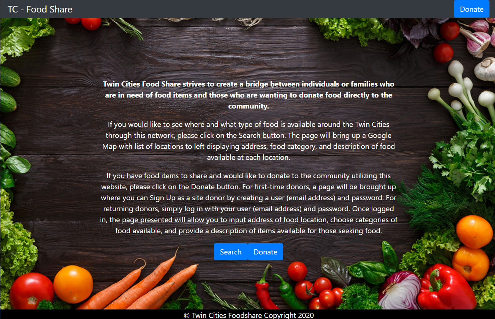
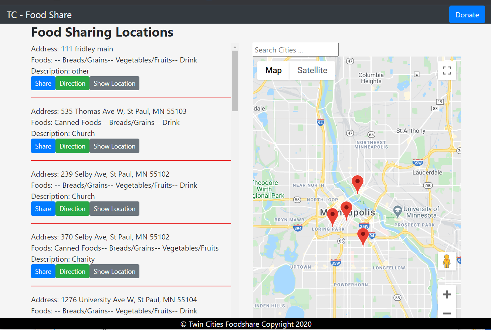
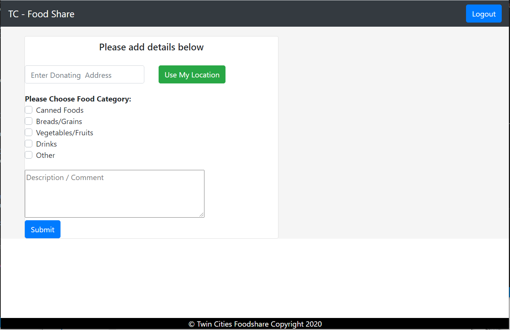

# Title

## Table of Contents

- [Description](#Description)
- [Screen Shots](#Screen-Shots)
- [Installation](#installation)
- [Usage](#usage)
- [Technology Used](#Technology-Used)
- [License](#license)

## Deployed Site
 [Click Here ](https://tc-food-share.herokuapp.com/)

## Description
### As a user:

I want to find free meals, produce, and groceries near me so that I can have access to food in the Twin Cities.
I can search by areas  locate the area by zooming on the map
When I click on the pin on the map
It shows me the description, date added, and the donor
It gives me an option to get direction an option to share

### As a Registered User 
I can drop a pin for the product's:
Location 
Date 
Quantity 
I can delete the pin from the map when the product is not available anymore. 

## Screen-Shots

## Technology-Used

- React.JS
- Javascript
- Bootstrap
- Google Map API
- Auth0
- MySQL / Sequelize
- Node.js

## License

## Question

If you have any questions please feel free to contact us.

**Email** 
- zakfena@gmail.com
- behnert77@gmail.com
- eshook89@gmail.com
- r.vang012@gmail.com
- willdoinc@gmail.com
- mohamudayub@gmail.com

